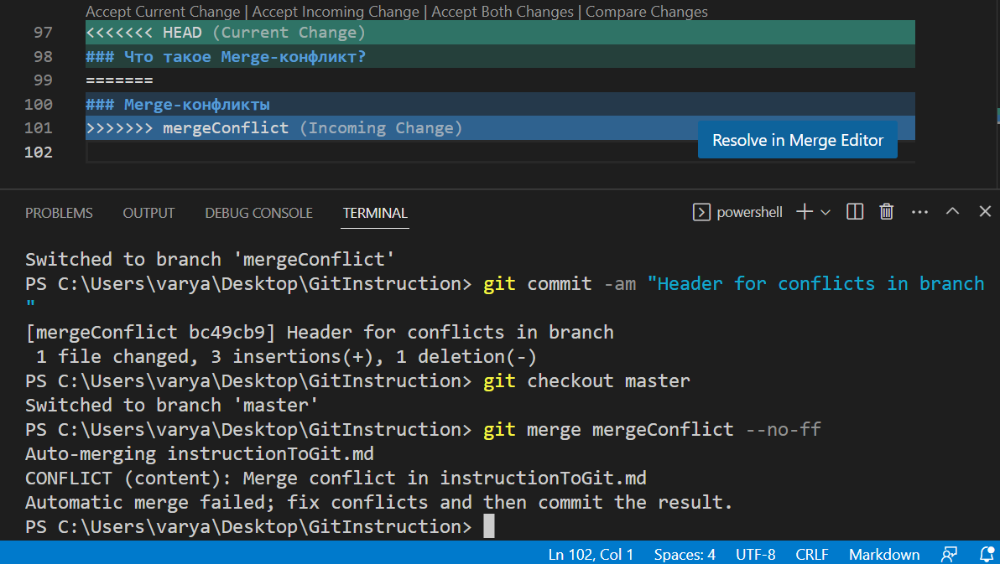

# Инструкция по работе с Git 
Git - это программа, которая используется используется разработчиками для контроля версий, то есть она отслеживает любые изменения в проекте и их историю. 

## Создание нового репозитория 

Для того, чтобы начать работу с Git, необходимо для начала создать папку, в которую будут загружаться все изменения нашего файла. 

После создания папки на диске компьютера, нужно открыть её в visual studio code и  ввести команду: 

    git init

Так мы инициализируем (init - initialize) новый репозиторий.

## Проверка актуального состояния репозитория

Для того, чтобы проверить в каком состоянии находится репозиторий, в частности узнать были ли в нем какие-то изменения, нужно ввести команду:

    git status

## Сохранение изменений перед коммитом

Перед тем, как сохранять наши изменения в историю, необходимо сохранить данные и добавить содержимое файла в индекс, для этого можно использовать команду: 

    git add <name of file>

## Сохранение изменений в файле 

Для того, чтобы непосредственно сохранить наши изменения в историю, необходимо ввести команду:

    git commit 

Однако если после commit мы просто нажимаем Enter, то у нас откроется текстовый редактор для ввода комментария. Гораздо менее энергозатратным будет ввести комментарий к изменению прямо в терминале. Для этого вводим команду:

    git commit -m "message"

Существует так же команда, позволяющая сохранить сразу все изменения в индекс. Для этого используем: 

    git commit -am "message"

где a - add, то есть команду add перед этим писать не нужно.

## Просмотр изменений в файле 

В случае если вы забыли сразу добавить новый коммит и соответственно добавить комментарий об изменениях, можно вспомнить, что за изменения были совершены, используя следующую команду:

    git diff

При её вводе будут выведены последние изменения файла.

Однако если необходимо сравнить конкретные версии файлов, можно использовать: 

    git diff <hash1> <hash2> 

## Переход между версиями файла

Если необходимо перейти на определенную версию файла, нужно ввести команду: 

    git checkout <hash>

где hash - первые 5 цифр из номера коммита. 

## Просмотр истории коммитов в файле

Чтобы посмотреть все коммиты, нужно ввести команду: 

    git log

Так выводится время, дата изменений, а также комментарий, добавленный при коммите. 

Однако данную команду при необходимости можно дополнить. Например, если мы не хотим, чтобы много раз выводилась одна и та же информация об авторе и дате, можно ввести команду: 

    git log --oneline 

Если же HEAD коммит является не тем, что был сделан последним, при вызове git log мы не увидим коммиты, которые были сделаны после него. Чтобы этого избежать, можно использовать следующие команды:
    
    git log --all
    git log --all --oneline

## Работа с ветвлениями

### Что такое ветвление и зачем оно нужно? 
Для более комфортной работы с файлами и сохранения различных его версий, можно использовать ветвление. Это позволяет разделять работу над различными частями файла и при небходимости объединять их или наоборот удалять.

### Базовые команды ветвления
Для того, чтобы посмотреть, какие ветки у вас уже созданы, нужно использовать следующую команду: 

    git branch

Однако если необходимо создать новую ветку, важно так же ввести её название: 
    
    git branch <branch_name>

Если мы закончили работу с определенной веткой, можно объединить её с основной, тогда нужно просто перейти в главную ветку, ввести merge и ввести название ветки, которую хотим присоединить: 

    git branch merge <branch_name>

### Merge-конфликты

Бывают ситуации, в которых мы изменяем одну и ту же часть файла, находясь при этом на разных ветках. Тогда при слиянии веток происходит merge конфликт. Что делать в данной ситуации? Git выдаст ошибку, тогда необходимо внести изменения в наш файл, так как сам Git не может четко разделять содержимое файлов и их составляющие будут просто в неправильном порядке. Редактируем текст так, как нам нужно и сохраняем. 

### Как удалять ветки? 

В случае, если ветки были объединены, можно удалить ненужную ветку. Для этого используется следующая команда:
    git branch -d <branch_name>
Однако возможна ситуация, когда ветку нужно просто принудительно удалить, ни с чем не сливая, для этого вводим данную команду:
    git branch -D <branch_name>

### Как перемещаться между ветками?

Безусловно, чтобы работать с ветвлением, нужно уметь переключаться между ветками. Для этого пишем следующее: 

    git checkout <branch_name>

branch_name - имя ветки, на которую мы хотим перейти.

### Как увидеть схему ветвления?

Чтобы увидеть схему ветвления, нужно лишь ввести: 

    git log --graph

Так можно увидеть, какие ветки были созданы и соединены, а так же в каком порядке это было сделано. 

## Удаленные репозитории

Удаленные репозитории имеют несколько функций. Основными из них являются возможность удаленной работы и работы в команде. 

### Что необходимо сделать первым делом?

1. Создаем новую репозиторию в Github
2. Открывается страница, содержущая в себе строки, которые нужно вставить в терминал, чтобы инициализировать репозиторию для работы 
Важно заменить main на master (при необходимости) для более комфортной работы.
3. Проверяем, что наш исходный код появился в репозитории на Github

### Основные команды для работы с удаленнными репозиториями

    git push
С помощью данной команды можно "отправить" изменения нашего кода в удаленный репозиторий. 
    git pull 
Данная команда позволяет "забрать" код с Github, в случае если там были совершены какие-то изменения вами или другими людьми (кому такая возможность доступна).
    git clone
Эта команда необходима для того, чтобы полностью скачать репозиторий с Github и начать в ней работу на своем ПК. 
Важно отметить, что скачивание репозитория происходит с помощью Fork (т.е. мы просто делаем копию чьего-либо репозитории, а не делаем изменения в оригинале). Помимо этого необходимо начинать работу на своем ПК в новой ветке, чтобы отделить изменения собственные от изменений другого человека.
